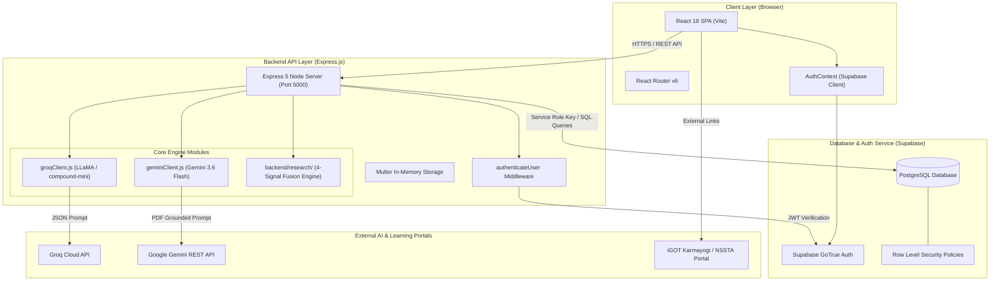

# 02 — Complete System Architecture

## Architectural Overview
The platform uses a decoupled client-server architecture powered by a **React SPA frontend**, an **Express.js API gateway**, a **Supabase PostgreSQL database**, and dual **AI service clients (Groq SDK & Google Gemini API)**.

---

## Layered Component Breakdown

### 1. Presentation Layer (Frontend)
- **Framework:** React 18 with Vite build tool.
- **Routing:** Client-side SPA routing via `react-router-dom`.
- **State Management:** React Context API (`AuthContext`) managing user session, profile loading, and tokens.
- **UI Components:** Modular JSX components styled with modern CSS custom properties and Lucide React icons.

### 2. Application & API Layer (Backend)
- **Framework:** Express.js running on Node.js.
- **Security:** CORS enabled, custom `authenticateUser` middleware verifying Bearer JWT tokens with Supabase Auth (`supabase.auth.getUser(token)`).
- **File Ingestion:** Multer middleware handling PDF uploads in-memory (max 15MB limit).
- **AI Orchestration:**
  - `groqClient.js`: Communicates with Groq Cloud API (`groq/compound-mini`) for single-item adaptive assessment question generation with fingerprint deduplication.
  - `geminiClient.js`: Extracts PDF text using `pdf-parse`, constructs grounded prompts, calls Google Gemini API (`gemini-3.6-flash`), and validates JSON MCQ output.
  - `backend/research/`: Isolated 4-Signal Fusion recommendation engine (`FusionEngine`, `KGEngine`, `SequenceEngine`, `CFEngine`, `MetricsEngine`).

### 3. Data & Security Layer (Supabase PostgreSQL)
- **Database Engine:** PostgreSQL hosted on Supabase.
- **Authentication:** Supabase GoTrue authentication provider issuing JWT tokens.
- **Access Control:** Row Level Security (RLS) policies enforcing user isolation across profiles, assessments, skill gaps, and recommendations.

---

## Source File References
- Server Entry Point: [server.js](file:///c:/Z%20Github%20Project/SIH-Smart-Education/backend/server.js#L1-L1375)
- Groq AI Client: [groqClient.js](file:///c:/Z%20Github%20Project/SIH-Smart-Education/backend/groqClient.js#L1-L332)
- Gemini AI Client: [geminiClient.js](file:///c:/Z%20Github%20Project/SIH-Smart-Education/backend/geminiClient.js#L1-L403)
- Research Fusion Engine: [fusionEngine.js](file:///c:/Z%20Github%20Project/SIH-Smart-Education/backend/research/fusionEngine.js#L1-L156)
