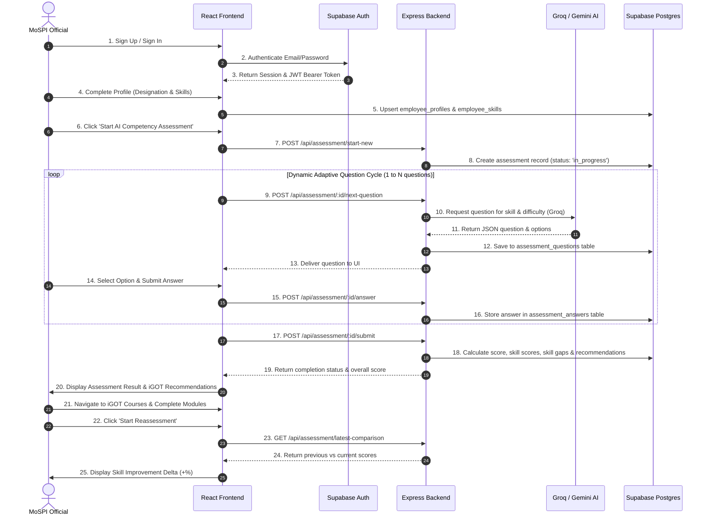

# 04 — Complete User Workflow

## End-to-End Platform Journey Flowchart

---

## Detailed Step-by-Step Breakdown

| Step # | Stage | User Action | Frontend Page | Backend API Endpoint | Database Table | AI Involvement | Output |
| :---: | :--- | :--- | :--- | :--- | :--- | :--- | :--- |
| **1** | Auth | Enter Email & Password | `Login.jsx` / `Signup.jsx` | `supabase.auth.signInWithPassword` | `auth.users` | None | Active JWT Session |
| **2** | Profile | Select Designation & Skills | `Profile.jsx` | Direct Supabase Client | `employee_profiles`, `employee_skills` | None | Saved Profile Record |
| **3** | Assessment Info | Click AI Assessment | `Dashboard.jsx` | `GET /api/assessment/info` | `skills`, `designation_skills` | None | Assessment Metadata |
| **4** | Assessment Start | Click Start Test | `Assessment.jsx` | `POST /api/assessment/start-new` | `assessments` | None | `assessmentId` |
| **5** | Question Gen | View Question | `Assessment.jsx` | `POST /api/assessment/:id/next-question` | `assessment_questions` | Groq `compound-mini` | Grounded MCQ |
| **6** | Answer Submit | Select Choice | `Assessment.jsx` | `POST /api/assessment/:id/answer` | `assessment_answers` | None | Is Correct Flag |
| **7** | Final Submit | Complete Test | `Assessment.jsx` | `POST /api/assessment/:id/submit` | `assessment_skill_scores`, `skill_gaps`, `recommendations` | Fast Rule Analysis | Calculated Scores & Gaps |
| **8** | Result View | Review Performance | `AssessmentResult.jsx` | `GET /api/assessment/result/:id` | `assessment_analyses` | None | Score Breakdown & Courses |
| **9** | Learning | Click iGOT Module | `IgotDashboard.jsx` | `GET /api/recommendations/user` | `courses`, `recommendations` | None | Course Catalog & Link |
| **10** | Reassessment | Initiate Retest | `Reassessment.jsx` | `GET /api/assessment/reassessment-info` | `assessments`, `skill_gaps` | Groq `compound-mini` | Score Comparison & Delta |
