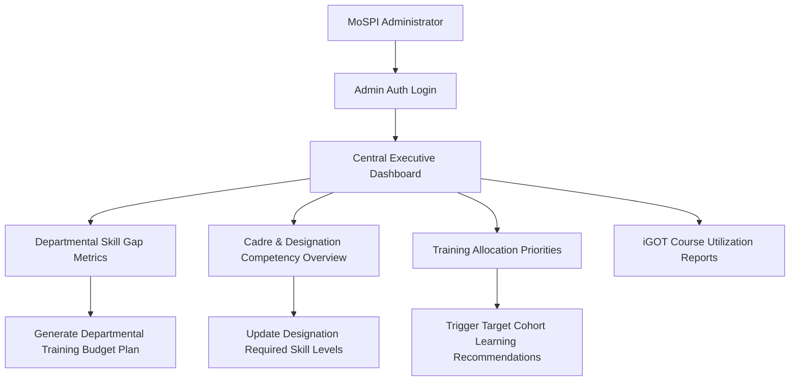

# 06 — Admin Workflow

## Current Status Notice
> **Status:** `PROPOSED / FUTURE` (Production Admin Portal)  
> **Status:** `CURRENT / IMPLEMENTED` (Synthetic Demonstration via Research Engine `ResearchEngine.jsx`)

Production administrator features for departmental skill gap aggregation and nationwide training planning are documented here as proposed specifications. Synthetic cohort analysis and interactive recommendation engine experimentation are fully operational in `ResearchEngine.jsx`.

---

## Proposed Production Administrator Workflow

---

## Detailed Admin Functions & Capabilities

### 1. Departmental Competency Monitoring (`PROPOSED`)
- View aggregated average competency scores across MoSPI divisions (NSO, SDRD, DPD, FOD, Price Statistics Division).
- Identify system-wide common skill deficiencies (e.g., 68% of Assistant Statistical Officers lack advanced R/Python programming proficiency).

### 2. Training Allocation & Priority Planning (`PROPOSED`)
- Allocate specialized training seats at NSSTA (National Statistical Systems Training Academy) based on empirical skill gap priority counts.
- Generate automated training nomination lists targeting employees with "High" priority skill gaps.

### 3. Interactive Research & Recommendation Simulation (`IMPLEMENTED IN RESEARCH ENGINE`)
- Accessible via `/research-engine`.
- Select from 50 synthetic MoSPI demo profiles.
- Adjust 4-signal fusion recommendation weights ($w_{gap}, w_{kg}, w_{seq}, w_{cf}$).
- Visualize TransE Knowledge Graph edges connecting designations, skills, and courses.
- Run ablation studies to measure individual recommendation signal impact.

---

## Source File References
- Research Demonstration Module: [ResearchEngine.jsx](file:///c:/Z%20Github%20Project/SIH-Smart-Education/frontend/src/pages/ResearchEngine.jsx#L1-L450)
- Fusion Engine Logic: [fusionEngine.js](file:///c:/Z%20Github%20Project/SIH-Smart-Education/backend/research/fusionEngine.js#L1-L156)
