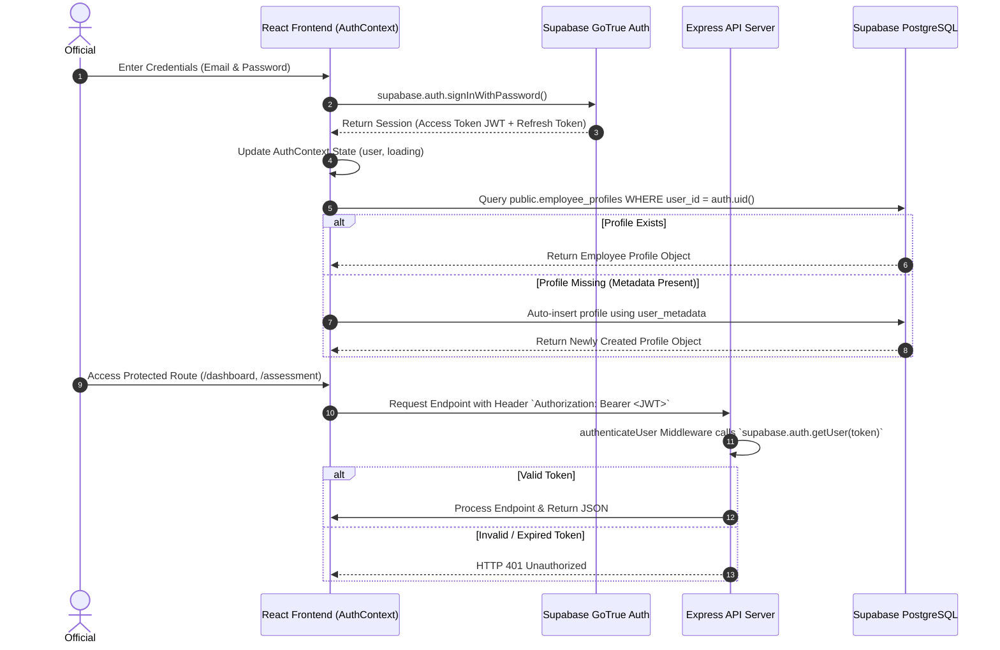

# 07 — Authentication Workflow

## Feature Specifications

- **Feature Name:** User Authentication & Authorization Engine
- **Purpose:** Secure identity verification, session persistence, role identification, and protected route access for MoSPI personnel.
- **Current Status:** `CURRENT / IMPLEMENTED`

---

## Technical Architecture & Security Flow

---

## Key Authentication Components

### 1. Client-Side Auth Provider (`frontend/src/context/AuthContext.jsx`)
- Listens to authentication state changes via `supabase.auth.onAuthStateChange()`.
- Automatically fetches or creates linked records in `public.employee_profiles`.
- Handles session recovery from local storage via `supabase.auth.getSession()`.
- Provides global context methods (`signOut`, `reloadProfile`).

### 2. Route Guarding Components
- **`ProtectedRoute.jsx`:** Restricts access to authenticated users with active sessions. Unauthenticated users are redirected to `/login`.
- **`GuestRoute.jsx`:** Prevents logged-in users from accessing guest pages (`/login`, `/signup`), automatically redirecting them to `/dashboard`.

### 3. Backend Authorization Middleware (`backend/server.js:41-76`)
- `authenticateUser` middleware checks incoming request headers.
- Supports both Supabase JWT Bearer token verification (`Authorization: Bearer <token>`) and direct user identification headers (`x-user-id`) for internal server operations.

---

## Source File References
- Auth Context Provider: [AuthContext.jsx](file:///c:/Z%20Github%20Project/SIH-Smart-Education/frontend/src/context/AuthContext.jsx#L1-L160)
- Protected Route Guard: [ProtectedRoute.jsx](file:///c:/Z%20Github%20Project/SIH-Smart-Education/frontend/src/components/ProtectedRoute.jsx#L1-L30)
- Backend Authentication Middleware: [server.js](file:///c:/Z%20Github%20Project/SIH-Smart-Education/backend/server.js#L41-L76)
