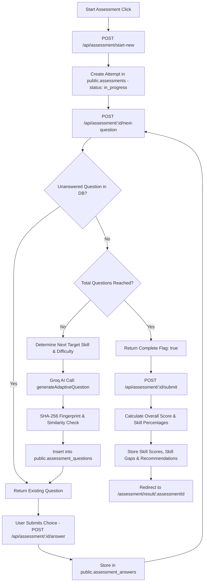

# 08 — Assessment Workflow

## Feature Specifications

- **Feature Name:** AI-Driven Adaptive Competency Assessment
- **Purpose:** Dynamically generate question-by-question statistical evaluations tailored to employee skills and designation requirements.
- **Current Status:** `CURRENT / IMPLEMENTED`

---

## Workflow & System Flow



---

## Technical Features & Deduplication Safeguards

### 1. Single-Item AI Generation (`groqClient.js`)
- Uses Groq Cloud API (`groq/compound-mini`) to generate **exactly 1 question per API call**.
- Prevents timeout issues associated with batch generation.

### 2. SHA-256 Fingerprint Deduplication
- Every generated question text is normalized (`lowercase`, alphanumeric only) and hashed via SHA-256.
- Hashing code:
  ```js
  function generateFingerprint(questionText) {
    const normalized = String(questionText).toLowerCase().replace(/[^a-z0-9]/g, '');
    return crypto.createHash('sha256').update(normalized).digest('hex');
  }
  ```
- Before presenting a question, the server queries all historical questions generated for the user across all past attempts. If a fingerprint or high Jaccard similarity (>70%) is detected, the item is rejected and a dynamic fallback is supplied.

### 3. Adaptive Difficulty Rules
- Initial difficulty starts at `medium`.
- If an employee answers correctly, difficulty shifts `medium` $
ightarrow$ `hard` or `easy` $
ightarrow$ `medium`.
- If incorrect, difficulty shifts `hard` $
ightarrow$ `medium` or `medium` $
ightarrow$ `easy`.

---

## Source File References
- Assessment Backend Endpoints: [server.js](file:///c:/Z%20Github%20Project/SIH-Smart-Education/backend/server.js#L172-L887)
- Groq AI Adaptive Client: [groqClient.js](file:///c:/Z%20Github%20Project/SIH-Smart-Education/backend/groqClient.js#L155-L244)
- Assessment Page UI: [Assessment.jsx](file:///c:/Z%20Github%20Project/SIH-Smart-Education/frontend/src/pages/Assessment.jsx#L1-L350)
