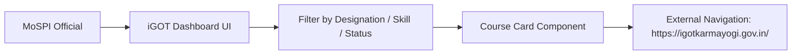

# 11 — iGOT Learning

## Feature Specifications

- **Feature Name:** iGOT Karmayogi / NSSTA Course Integration Catalog
- **Purpose:** Present curated statistical learning courses aligned with MoSPI official skills, offering direct access links to India's national civil service learning platform.
- **Current Status:** `MOCK / DEMO` (Verified Catalog with Links to Official Portal)

---

## Integration Details & Catalog Overview

While production OAuth 2.0 API synchronization with government iGOT servers is `PROPOSED / FUTURE`, the current application provides a verified pre-seeded course catalog mapped to official statistical competencies.

### Pre-Seeded Official MoSPI / NSSTA Courses in Catalog

| Course Title | Provider | Target Skill | Level | Verified URL |
| :--- | :--- | :--- | :--- | :--- |
| **Introduction to Official Statistical System & NSO Operations** | NSSTA / iGOT Karmayogi | Official Statistics | Intermediate | `https://igotkarmayogi.gov.in/` |
| **Data Analysis and Visualization for Public Policy** | Capacity Building Commission (CBC) | Data Visualization | Intermediate | `https://igotkarmayogi.gov.in/` |
| **Python & R Programming for Statistical Computing** | IT & Computer Centre, MoSPI | Python Programming | Advanced | `https://igotkarmayogi.gov.in/` |
| **Sample Survey Design & Field Operation Standards** | SDRD, NSO / iGOT | Survey Methodology | Intermediate | `https://igotkarmayogi.gov.in/` |
| **Data Quality Management & Audit in National Surveys** | DPD, NSO / iGOT | Data Quality Management | Beginner | `https://igotkarmayogi.gov.in/` |
| **Advanced Statistical Analysis & Regression Methods** | NSSTA / iGOT Karmayogi | Statistical Analysis | Advanced | `https://igotkarmayogi.gov.in/` |

---

## Source File References
- Database Course Catalog Seed: [006_skill_gap_schema.sql](file:///c:/Z%20Github%20Project/SIH-Smart-Education/database/006_skill_gap_schema.sql#L82-L159)
- iGOT Dashboard Page: [IgotDashboard.jsx](file:///c:/Z%20Github%20Project/SIH-Smart-Education/frontend/src/pages/IgotDashboard.jsx#L1-L250)
