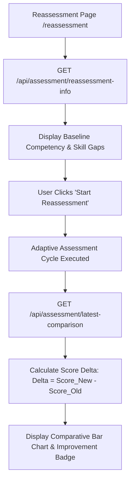

# 13 — Reassessment & Improvement

## Feature Specifications

- **Feature Name:** Reassessment & Competency Growth Tracking Engine
- **Purpose:** Quantify skill growth, measure percentage improvement deltas (+%), and evaluate skill gap closure following completion of learning modules.
- **Current Status:** `CURRENT / IMPLEMENTED`

---

## Reassessment Workflow & Comparative Analytics



---

## Comparison API Specification (`GET /api/assessment/latest-comparison`)

The backend compares the two most recent completed assessments for the authenticated user ([server.js:354-374](file:///c:/Z%20Github%20Project/SIH-Smart-Education/backend/server.js#L354-L374)):

```js
const [current, previous] = assessments;
const { data: currentScores } = await supabase.from('assessment_skill_scores').select('skill_id, score_percentage').eq('assessment_id', current.id);
const { data: previousScores } = await supabase.from('assessment_skill_scores').select('skill_id, score_percentage').eq('assessment_id', previous.id);

res.json({
   success: true,
   hasComparison: true,
   current: { id: current.id, overall: current.score_percentage, scores: currentScores },
   previous: { id: previous.id, overall: previous.score_percentage, scores: previousScores }
});
```

---

## Source File References
- Backend Reassessment API: [server.js](file:///c:/Z%20Github%20Project/SIH-Smart-Education/backend/server.js#L238-L374)
- Reassessment UI Page: [Reassessment.jsx](file:///c:/Z%20Github%20Project/SIH-Smart-Education/frontend/src/pages/Reassessment.jsx#L1-L320)
