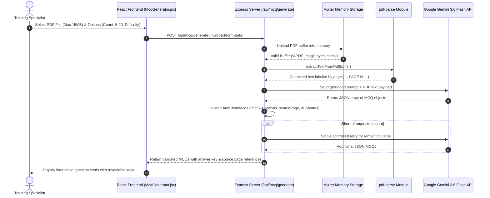

# 14 — MCQ Generator

## Feature Specifications

- **Feature Name:** Grounded AI PDF MCQ Generator Engine
- **Purpose:** Allow MoSPI training coordinators and instructors to upload official PDF documents (survey manuals, guidelines, report drafts) and generate grounded multiple-choice questions automatically.
- **Current Status:** `CURRENT / IMPLEMENTED`

---

## Technical Architecture & Ingestion Flow



---

## Strict Output JSON Schema

```json
[
  {
    "question": "What is the minimum sampling unit in NSO Urban Frame Survey (UFS)?",
    "options": {
      "A": "Investigation Unit (IV Unit)",
      "B": "Census Enumeration Block (CEB)",
      "C": "District Magistrate Ward",
      "D": "Gram Panchayat Sub-Division"
    },
    "correctAnswer": "A",
    "explanation": "According to UFS guidelines (Page 12), the Investigation Unit forms the basic geographic building block.",
    "sourcePage": 12,
    "difficulty": "MEDIUM"
  }
]
```

---

## Validation & Quality Safeguards (`geminiClient.js:126-195`)
1. **Magic Bytes Check:** Verifies `%PDF-` header magic bytes to prevent non-PDF file processing.
2. **Strict 4 Options:** Ensures options `A`, `B`, `C`, and `D` are all non-empty strings and mutually unique.
3. **Valid Source Page:** Verifies `sourcePage` is a positive integer bounded by total PDF pages ($1 \le \text{sourcePage} \le \text{totalPages}$).
4. **No Retry Loops:** Features smart model fallback (`gemini-3.6-flash` $\rightarrow$ `gemini-2.5-flash`) and a maximum of 1 controlled retry to guarantee API safety.

---

## Source File References
- Gemini Client Module: [geminiClient.js](file:///c:/Z%20Github%20Project/SIH-Smart-Education/backend/geminiClient.js#L1-L403)
- API Endpoint Handler: [server.js](file:///c:/Z%20Github%20Project/SIH-Smart-Education/backend/server.js#L1131-L1200)
- MCQ Generator Page: [McqGenerator.jsx](file:///c:/Z%20Github%20Project/SIH-Smart-Education/frontend/src/pages/McqGenerator.jsx#L1-L300)
