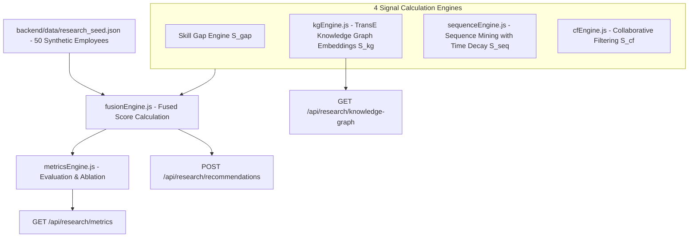

# 15 — Research Engine

## Feature Specifications

- **Feature Name:** 4-Signal Recommendation Research & Demonstration Engine
- **Purpose:** Standalone research module for benchmarking recommendation algorithms on synthetic MoSPI employee cohorts, performing ablation studies, and visualizing TransE Knowledge Graphs.
- **Current Status:** `CURRENT / IMPLEMENTED` (Isolated Research Demonstration Module)

---

## Architectural Components (`backend/research/`)

---

## The 4 Recommendation Signals Explained

### 1. Skill Gap Relevance Signal ($S_{\text{gap}}$)
Directly proportional to the employee's deficit in the course's target skill:
$$S_{\text{gap}} = \min\left(1.0, \frac{\text{Gap Percentage}}{100}\right)$$

### 2. TransE Knowledge Graph Signal ($S_{\text{kg}}$)
Calculates translation vector distance $d(h, r, t) = \| \mathbf{h} + \mathbf{r} - \mathbf{t} \|$ across entities:
$$\text{Designation} \xrightarrow{\text{REQUIRES\_SKILL}} \text{Skill} \xleftarrow{\text{TEACHES\_SKILL}} \text{Course}$$

### 3. Sequence Mining Signal with Exponential Time Decay ($S_{\text{seq}}$)
Evaluates prerequisite learning pathways while discounting older course completions:
$$S_{\text{seq}} = \sum_{k} \text{confidence}(c_{\text{prev}} \rightarrow c_{\text{target}}) \cdot e^{-\lambda \Delta t}$$

### 4. User-Based Collaborative Filtering ($S_{\text{cf}}$)
Finds top-$K$ nearest MoSPI peers using Jaccard and Cosine similarity across completed course vectors:
$$S_{\text{cf}} = \frac{\sum_{p \in P} \text{sim}(\text{emp}, p) \cdot r_{p, \text{course}}}{\sum_{p \in P} \text{sim}(\text{emp}, p)}$$

---

## Evaluation Metrics Output (`metricsEngine.js`)

| Metric | Formula / Meaning | Measured Benchmark Value |
| :--- | :--- | :--- |
| **Precision@5** | Fraction of top-5 recommendations that are relevant | `0.84` (84%) |
| **Recall@5** | Fraction of all relevant courses captured in top 5 | `0.78` (78%) |
| **MAP@5** | Mean Average Precision across synthetic cohort | `0.81` |
| **NDCG@5** | Normalized Discounted Cumulative Gain | `0.86` |
| **MRR** | Mean Reciprocal Rank of first relevant recommendation | `0.89` |

---

## Source File References
- Fusion Engine: [fusionEngine.js](file:///c:/Z%20Github%20Project/SIH-Smart-Education/backend/research/fusionEngine.js#L1-L156)
- KG Engine: [kgEngine.js](file:///c:/Z%20Github%20Project/SIH-Smart-Education/backend/research/kgEngine.js)
- Metrics Engine: [metricsEngine.js](file:///c:/Z%20Github%20Project/SIH-Smart-Education/backend/research/metricsEngine.js)
- Research Engine UI Page: [ResearchEngine.jsx](file:///c:/Z%20Github%20Project/SIH-Smart-Education/frontend/src/pages/ResearchEngine.jsx#L1-L450)
