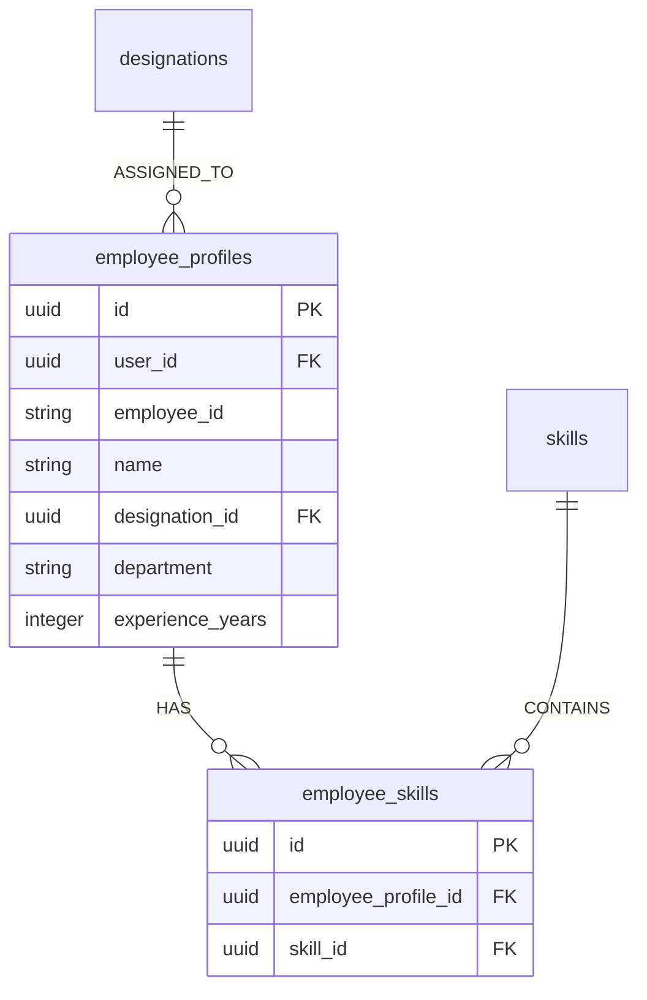

# 17 — Profile Management

## Feature Specifications

- **Feature Name:** Employee Profile & Skill Mapping Manager
- **Purpose:** Allow personnel to configure official metadata (Designation UUID, Department, Experience) and select active statistical competencies.
- **Current Status:** `CURRENT / IMPLEMENTED`

---

## Data Schema & Relationships



---

## Fallback & Initialization Protocol (`server.js:172-234`)

When starting an assessment or loading dashboard data, if an employee has not explicitly selected skills in `employee_skills`, the backend applies an automatic fallback cascade:

```
1. Explicit Employee Skills (employee_skills)
       │ (If empty)
       ▼
2. Designation Default Skills (designation_skills)
       │ (If empty)
       ▼
3. Top System Skills (skills catalog limit 4)
       │ (Auto-populate)
       ▼
Insert missing skills into employee_skills automatically
```

---

## Source File References
- Profile Setup Page UI: [Profile.jsx](file:///c:/Z%20Github%20Project/SIH-Smart-Education/frontend/src/pages/Profile.jsx#L1-L300)
- Skill Selector Component: [SkillSelector.jsx](file:///c:/Z%20Github%20Project/SIH-Smart-Education/frontend/src/components/SkillSelector.jsx#L1-L120)
- Auth Context Profile Handler: [AuthContext.jsx](file:///c:/Z%20Github%20Project/SIH-Smart-Education/frontend/src/context/AuthContext.jsx#L14-L83)
