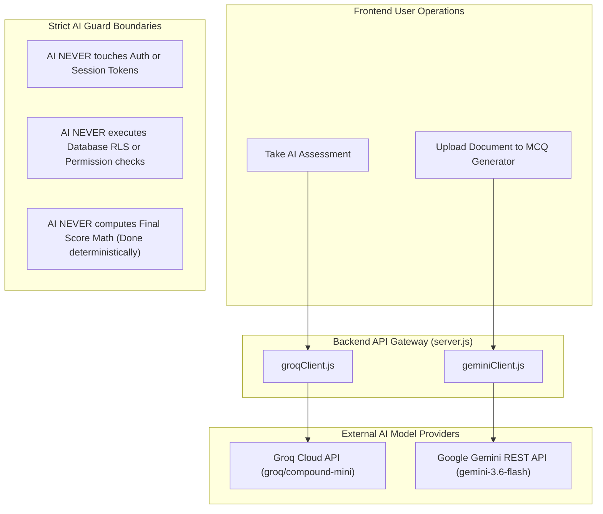

# 18 — AI Architecture

## Complete AI System Specification

The platform implements a **Dual AI Client Architecture** separating real-time adaptive question generation from grounded document processing.

---

## Dual Model Allocation Matrix

| Use Case | AI Model Provider | Model Name | Ingestion Input | Temperature | Output Format | Deduplication Strategy |
| :--- | :--- | :--- | :--- | :---: | :--- | :--- |
| **Adaptive Assessment Questions** | Groq Cloud API | `groq/compound-mini` | Skill Name & Difficulty | `0.5` | JSON (Single Question) | SHA-256 Fingerprint + 70% Jaccard Similarity |
| **Document MCQ Generation** | Google Gemini API | `gemini-3.6-flash` | PDF Text (`pdf-parse`) | `0.2` | JSON Array (4 Options, Page Ref) | Word N-gram Token Overlap (>85%) |

---

## Strict Non-Responsibilities of AI
1. **Authentication:** User identity and session validation are exclusively managed by Supabase GoTrue Auth.
2. **Authorization:** Access to rows is controlled by PostgreSQL Row Level Security (RLS) policies.
3. **Score Math:** Test scores, skill gap percentages, and priorities are calculated via deterministic JavaScript equations.

---

## Source File References
- Groq AI Client: [groqClient.js](file:///c:/Z%20Github%20Project/SIH-Smart-Education/backend/groqClient.js#L1-L332)
- Gemini AI Client: [geminiClient.js](file:///c:/Z%20Github%20Project/SIH-Smart-Education/backend/geminiClient.js#L1-L403)
