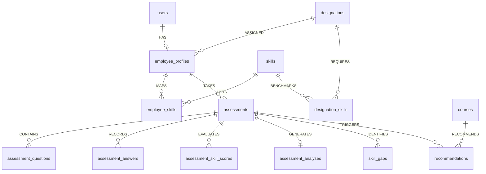

# 19 — Database Architecture

## Supabase PostgreSQL Schema & ERD

---

## Master Database Table Specifications

| Table Name | Primary Key | Key Foreign Keys | Purpose | RLS Policy |
| :--- | :--- | :--- | :--- | :--- |
| `public.employee_profiles` | `id` (UUID) | `user_id` -> `auth.users` | Stores MoSPI employee metadata | `auth.uid() = user_id` |
| `public.designations` | `id` (UUID) | None | Reference catalog of official cadres | Public Read |
| `public.skills` | `id` (UUID) | None | Reference catalog of statistical skills | Public Read |
| `public.employee_skills` | `id` (UUID) | `employee_profile_id`, `skill_id` | Junction table for user skills | Owned Profile Access |
| `public.designation_skills` | `id` (UUID) | `designation_id`, `skill_id` | Cadre benchmark required levels | Public Read |
| `public.assessments` | `id` (UUID) | `user_id`, `employee_profile_id` | Assessment test attempts | `auth.uid() = user_id` |
| `public.assessment_questions` | `id` (UUID) | `assessment_id`, `skill_id` | Questions generated for test | Owned Assessment Access |
| `public.assessment_answers` | `id` (UUID) | `assessment_id`, `question_id` | Answers submitted by user | Owned Assessment Access |
| `public.assessment_skill_scores`| `id` (UUID) | `assessment_id`, `skill_id` | Per-skill score percentage | Owned Assessment Access |
| `public.assessment_analyses` | `id` (UUID) | `assessment_id` | Strengths & weaknesses JSON | Owned Assessment Access |
| `public.skill_gaps` | `id` (UUID) | `user_id`, `assessment_id`, `skill_id` | Calculated skill deficits | `auth.uid() = user_id` |
| `public.courses` | `id` (UUID) | `skill_id` | iGOT / NSSTA course catalog | Public Read |
| `public.recommendations` | `id` (UUID) | `user_id`, `course_id`, `assessment_id` | Assigned learning modules | `auth.uid() = user_id` |

---

## Source File References
- Designations Seed: [002_designations_seed.sql](file:///c:/Z%20Github%20Project/SIH-Smart-Education/database/002_designations_seed.sql)
- Skills Seed: [003_skills_seed.sql](file:///c:/Z%20Github%20Project/SIH-Smart-Education/database/003_skills_seed.sql)
- Assessment Schema: [005_assessment_schema.sql](file:///c:/Z%20Github%20Project/SIH-Smart-Education/database/005_assessment_schema.sql)
- Skill Gap Schema: [006_skill_gap_schema.sql](file:///c:/Z%20Github%20Project/SIH-Smart-Education/database/006_skill_gap_schema.sql)
