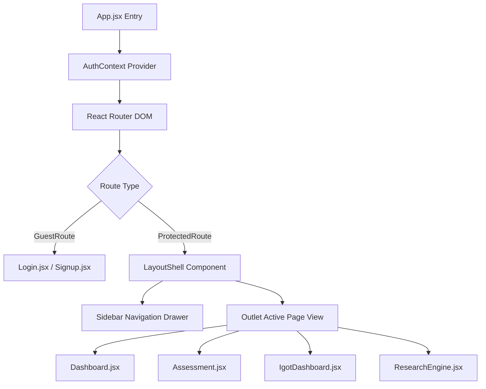

# 21 — Frontend Architecture

## Component Tree & Directory Structure

```
frontend/
├── src/
│   ├── main.jsx                 # Entry point mounting React DOM root
│   ├── App.jsx                  # Top-level BrowserRouter & Route definitions
│   ├── App.css                  # Global layout styles & UI utilities
│   ├── index.css                # Base CSS variables & glassmorphism theme
│   ├── components/
│   │   ├── Layout.jsx           # Master AppShell with Collapsible Sidebar & Header
│   │   ├── ProtectedRoute.jsx   # Auth guard for restricted routes
│   │   ├── GuestRoute.jsx       # Auth guard for login/signup pages
│   │   ├── LoadingScreen.jsx    # Full-screen spinner component
│   │   └── SkillSelector.jsx    # Multi-select chip selector for skills
│   ├── context/
│   │   └── AuthContext.jsx      # React Context providing session & profile state
│   ├── lib/
│   │   ├── supabase.js          # Supabase client singleton setup
│   │   └── referenceData.js     # API & DB fetch helpers for designations/skills
│   └── pages/
│       ├── Dashboard.jsx        # Employee overview & assessment summaries
│       ├── Profile.jsx          # Profile setup & skill selection page
│       ├── Assessment.jsx       # Adaptive AI quiz presentation page
│       ├── AssessmentResult.jsx # Test score breakdown & recommendation summary
│       ├── Reassessment.jsx     # Historical attempt comparison & retake UI
│       ├── IgotDashboard.jsx    # iGOT / NSSTA course catalog browser
│       ├── McqGenerator.jsx     # Document upload & grounded MCQ generation
│       ├── ResearchEngine.jsx   # 4-Signal Fusion recommendation laboratory
│       ├── Login.jsx            # Sign-in page
│       └── Signup.jsx           # Registration page with metadata onboarding
```

---

## State Flow & Protection Architecture



---

## Source File References
- App Routing Entry: [App.jsx](file:///c:/Z%20Github%20Project/SIH-Smart-Education/frontend/src/App.jsx#L1-L84)
- Master Layout Shell: [Layout.jsx](file:///c:/Z%20Github%20Project/SIH-Smart-Education/frontend/src/components/Layout.jsx#L1-L158)
