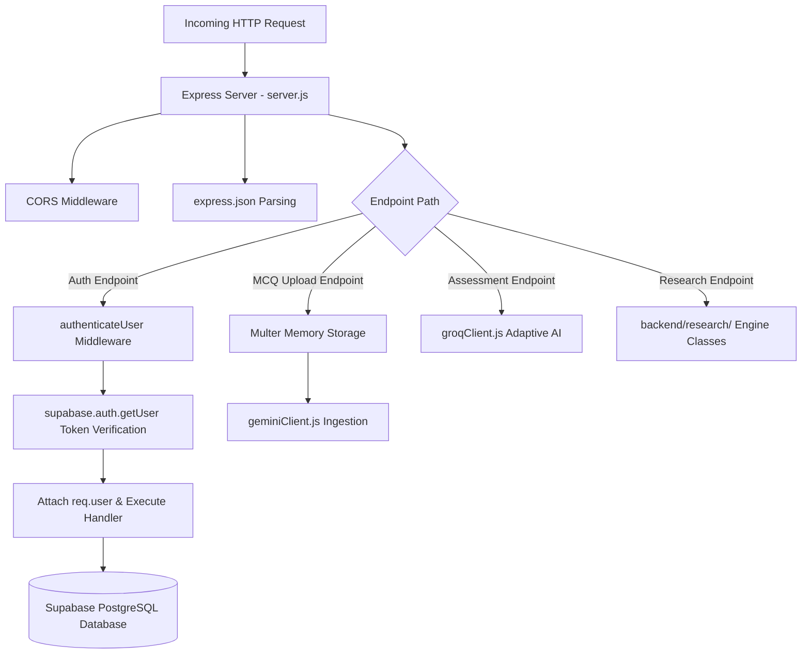

# 22 — Backend Architecture

## Server Architecture & Internal Layering

The Express backend operates as a Node.js API gateway managing authentication, dynamic AI orchestration, database queries, and recommendation engines.

---

## Module Responsibility Map

| Module File | Purpose & Responsibilities | Key Exported Functions |
| :--- | :--- | :--- |
| **`server.js`** | Express application setup, route mounting, authentication middleware, score calculation logic, skill gap processing | Server instance on Port 5000 |
| **`groqClient.js`** | Groq Cloud SDK wrapper, adaptive single-question prompt construction, SHA-256 fingerprinting, fallback bank | `generateAdaptiveQuestion`, `generateAssessmentAnalysis`, `generateFingerprint` |
| **`geminiClient.js`** | PDF buffer verification, text extraction via `pdf-parse`, grounded Gemini 3.6 Flash prompt execution, MCQ validation | `extractTextFromPdf`, `validateAndCleanMcqs`, `generateMcqsFromPdf` |
| **`fusionEngine.js`** | Fuses 4 recommendation signals ($S_{\text{gap}}, S_{\text{kg}}, S_{\text{seq}}, S_{\text{cf}}$) with normalized custom weight parameters | `FusionEngine.getRecommendations()` |
| **`kgEngine.js`** | TransE Knowledge Graph vector calculations across designations, skills, and courses | `KGEngine.getKGRelevanceScore()` |
| **`sequenceEngine.js`** | Evaluates course sequence pathways with exponential time decay ($e^{-\lambda t}$) | `SequenceEngine.getSequenceScore()` |
| **`cfEngine.js`** | Nearest-neighbor MoSPI peer recommendations via Jaccard & Cosine similarity | `CFEngine.getCFScore()`, `getSimilarEmployees()` |
| **`metricsEngine.js`** | Evaluates Precision@K, Recall@K, MAP, NDCG, MRR and runs ablation studies | `MetricsEngine.evaluateAll()`, `runAblationStudy()` |

---

## Source File References
- Express Backend Entry: [server.js](file:///c:/Z%20Github%20Project/SIH-Smart-Education/backend/server.js#L1-L1375)
