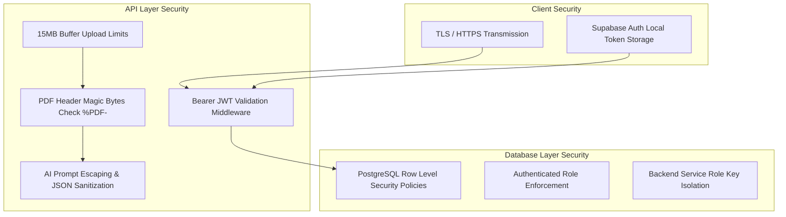

# 23 — Security Architecture

## Security & Privacy Guard Specifications



---

## Security Layer Breakdown

### 1. Authentication & Session Security
- **GoTrue Auth:** Managed by Supabase GoTrue authentication provider issuing cryptographically signed JWT tokens.
- **Header Token Transmission:** Requests from client to Express backend transmit tokens via standard `Authorization: Bearer <token>` HTTP headers.
- **Backend Verification:** `authenticateUser` middleware verifies token validity against Supabase Auth (`supabase.auth.getUser(token)`). Unauthorized requests return HTTP 401.

### 2. Database Row Level Security (RLS)
- RLS policies are enabled on all user data tables (`assessments`, `assessment_questions`, `assessment_answers`, `assessment_skill_scores`, `assessment_analyses`, `skill_gaps`, `recommendations`, `employee_profiles`).
- Policy rule enforces strict isolation:
  ```sql
  CREATE POLICY "Users can manage own assessments"
  ON public.assessments FOR ALL TO authenticated
  USING (auth.uid() = user_id) WITH CHECK (auth.uid() = user_id);
  ```

### 3. API Key & Environment Isolation
- API keys (`GROQ_API_KEY`, `GEMINI_API_KEY`, `SUPABASE_SECRET_KEY`) are stored strictly in backend `.env` configuration files and are **never exposed to the frontend JavaScript client bundle**.

### 4. Input Processing & Upload Security
- PDF file ingestion uses `Multer` with in-memory storage (no temporary files written to server disk).
- Strict 15MB file size limit enforced.
- Verification of `%PDF-` magic bytes header prevents malicious non-PDF uploads.

---

## Source File References
- Database RLS Policies: [004_rls_policies.sql](file:///c:/Z%20Github%20Project/SIH-Smart-Education/database/004_rls_policies.sql), [005_assessment_schema.sql](file:///c:/Z%20Github%20Project/SIH-Smart-Education/database/005_assessment_schema.sql#L85-L156)
- Authentication Middleware: [server.js](file:///c:/Z%20Github%20Project/SIH-Smart-Education/backend/server.js#L41-L76)
- PDF Ingestion Guard: [geminiClient.js](file:///c:/Z%20Github%20Project/SIH-Smart-Education/backend/geminiClient.js#L27-L37)
