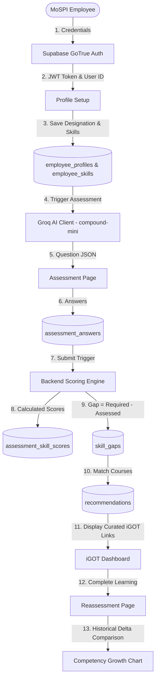

# 24 — Complete Data Flow

## Comprehensive Data Lifecycle

---

## Detailed Data Transformations & Formats

### 1. Ingestion Phase (User Metadata $\rightarrow$ Database Profile)
- Input: `{ name: "Ananya Roy", designation_id: "<UUID>", skill_ids: ["<UUID1>", "<UUID2>"] }`
- Storage: Standardized records in `public.employee_profiles` and `public.employee_skills`.

### 2. Assessment Phase (Dynamic Generation $\rightarrow$ Answer Persistence)
- Input: Selected skill object + difficulty (`medium`).
- AI Output: `{ skill_id: "...", question_text: "...", options: [...], correct_answer: "...", explanation: "..." }`
- Answer Payload: `{ questionId: "<UUID>", selectedAnswer: "Option Text" }`
- Calculation: `isCorrect = (selectedAnswer.trim().toLowerCase() === correct_answer.trim().toLowerCase())`

### 3. Analytics Phase (Deterministic Gap Scoring $\rightarrow$ Recommendation Mapping)
- Gap Percentage: $\max(0, \text{Required Score} - \text{Assessed Score})$
- Recommendation Payload: `{ user_id: "...", course_id: "...", skill_id: "...", reason: "Recommended to close High Priority Gap", priority: 1 }`

---

## Source File References
- Backend Data Transformations: [server.js](file:///c:/Z%20Github%20Project/SIH-Smart-Education/backend/server.js#L780-L990)
