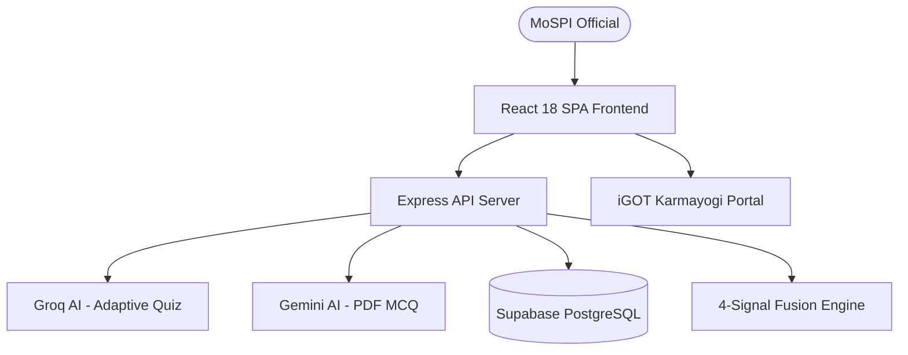

# 26 — Presentation Ready Content (SIH 2026 Slide Deck)

This document contains slide-by-slide text and structure ready for an official **Smart India Hackathon (SIH) 2026** presentation to MoSPI evaluators and jury members.

---

## SLIDE 1 — Title Slide
- **Project Title:** AI-Enabled Skill Intelligence and Learning Platform for India's Official Statistical System
- **SIH 2026 Problem Statement:** PS26101
- **Nodal Ministry:** Ministry of Statistics and Programme Implementation (MoSPI), Government of India
- **Domain:** Smart Education & Capacity Building
- **Team Name:** WhisTech

---

## SLIDE 2 — Problem Statement & Challenges
- **Diverse Cadres & Roles:** MoSPI manages personnel ranging from Assistant Statistical Officers to Senior Statistical Officers and Data Analysts with diverse skill requirements.
- **Lack of Objective Assessment:** Competency evaluation relies on subjective self-reporting rather than empirical, adaptive assessment.
- **Generic Training Allocation:** Off-the-shelf courses fail to target specific skill deficits.
- **Fragmented Learning Ecosystem:** Disconnect between identified skill gaps and course offerings on portals like iGOT Karmayogi and NSSTA.
- **Unmeasured Improvement:** Difficulty in quantifying post-training skill growth and return on capacity-building investments.

---

## SLIDE 3 — The Proposed Solution
- **End-to-End Skill Intelligence:** An integrated AI platform that continuously evaluates, identifies gaps, recommends courses, and measures progress.
- **8-Stage Capacity Building Loop:**
  ```
  ASSESS ──► ANALYZE ──► IDENTIFY GAP ──► RECOMMEND ──► LEARN ──► TRACK ──► REASSESS ──► IMPROVE
  ```
- **Tailored for MoSPI:** Configured with official designations, statistical skill taxonomies, and verified NSSTA/iGOT course catalogs.

---

## SLIDE 4 — Key Implemented Features
1. **Adaptive AI Competency Assessment:** Single-item question generation via Groq LLaMA AI with SHA-256 fingerprint deduplication.
2. **Deterministic Skill Gap Engine:** Calculates exact skill deficits ($Gap = Required - Assessed$) with High/Medium/Low priority tags.
3. **iGOT Karmayogi Course Recommendation:** Auto-maps skill gaps to verified national learning modules.
4. **Reassessment & Improvement Analytics:** Visualizes percentage growth (+%) and skill gap reduction over time.
5. **AI PDF MCQ Generator:** Grounded test generation from uploaded survey manuals using Gemini 3.6 Flash.
6. **Research Recommendation Engine:** 4-Signal Fusion algorithm (TransE Knowledge Graph, Sequence Mining, Collaborative Filtering, Skill Gap).

---

## SLIDE 5 — System Architecture

- **Decoupled Architecture:** React SPA + Express Gateway + Supabase PostgreSQL + Dual AI Clients.

---

## SLIDE 6 — Technology Stack
- **Frontend:** React 18, Vite 5, React Router DOM v6, Lucide Icons, Custom CSS Variables.
- **Backend:** Node.js, Express.js 4.21, Multer, `pdf-parse`.
- **Database & Auth:** Supabase PostgreSQL, GoTrue Auth (JWT Bearer tokens), Row Level Security (RLS).
- **AI Engines:** Groq SDK (`groq/compound-mini`), Google Gemini REST API (`gemini-3.6-flash`).
- **Research Module:** Custom ES6 Fusion, Knowledge Graph (TransE), Sequence Mining, and CF Engines.

---

## SLIDE 7 — Complete User Workflow
1. **Sign Up / Login:** Secure authentication with MoSPI email & password.
2. **Profile Configuration:** Select official designation (e.g., Statistical Officer) and active skills.
3. **Take AI Assessment:** Answer adaptive questions tailored to selected skills.
4. **View Skill Gaps:** Review score percentages, strengths, weaknesses, and priority gaps.
5. **Execute iGOT Learning:** Access recommended learning modules on iGOT Karmayogi.
6. **Take Reassessment:** Measure score improvement and gap closure.

---

## SLIDE 8 — AI Architecture & Guard Boundaries
- **Groq AI (`groq/compound-mini`):** Single-item adaptive question generation with zero retry loops and fingerprint deduplication.
- **Gemini AI (`gemini-3.6-flash`):** Grounded PDF document processing with page extraction and schema validation.
- **Strict Guard Boundaries:** AI does NOT touch authentication, does NOT execute RLS policy checks, and does NOT compute score math.

---

## SLIDE 9 — Database & Security Design
- **Supabase PostgreSQL Schema:** 13 tables including `employee_profiles`, `designation_skills`, `assessments`, `skill_gaps`, `courses`, and `recommendations`.
- **Security Protocols:** JWT Bearer authentication, Row Level Security (RLS) policies (`auth.uid() = user_id`), API keys isolated in backend `.env`, in-memory PDF buffer processing.

---

## SLIDE 10 — Personalization Engine
- **Multi-Factor Input:** Personalization is calculated using Designation Benchmark + Assessed Skill Scores + Identified Priority Gaps + Historical Attempt Growth.
- **Dynamic Adaptability:** Assessment difficulty adjusts dynamically based on live employee performance.

---

## SLIDE 11 — iGOT Karmayogi & NSSTA Integration
- **Verified Course Catalog:** Pre-seeded with courses from National Statistical Systems Training Academy (NSSTA) and Capacity Building Commission (CBC).
- **Status:** Verified Catalog with Links (`MOCK / DEMO`). Direct OAuth 2.0 API sync planned as `PROPOSED / FUTURE`.

---

## SLIDE 12 — Assessment & Scoring Engine
- **Adaptive Question Flow:** 1-by-1 item delivery ensures fast response times without API timeouts.
- **Deduplication Safeguard:** SHA-256 fingerprinting prevents question repetition across past user attempts.
- **Deterministic Scoring:** Skill score percentages computed directly from verified database responses.

---

## SLIDE 13 — Recommendation Engine Architecture
- **Production Engine:** Rule-based mapping connecting gap `skill_id` to catalog `courses`.
- **Research Fusion Engine:** Fuses 4 signals:
  - Skill Gap Magnitude ($S_{\text{gap}}$)
  - TransE Knowledge Graph Distance ($S_{\text{kg}}$)
  - Sequence Mining with Exponential Time Decay ($S_{\text{seq}}$)
  - User Collaborative Filtering ($S_{\text{cf}}$)

---

## SLIDE 14 — Reassessment & Improvement Tracking
- **Historical Comparison:** Side-by-side analysis of previous attempt score vs current attempt score.
- **Growth Metrics:** Quantifies percentage improvement delta (+%) and tracks gap closure.

---

## SLIDE 15 — Security, Privacy & Governance
- **Data Governance:** MoSPI employee data isolated via PostgreSQL Row Level Security.
- **API Security:** Backend proxy shielding AI keys from browser exposure.
- **Buffer Safety:** PDF uploads parsed in-memory with strict 15MB file size limit and magic bytes validation.

---

## SLIDE 16 — Projected Impact for MoSPI
- **Data-Driven Capacity Building:** Replaces subjective training requests with empirical skill gap metrics.
- **Targeted Budget Allocation:** Enables training academies (NSSTA) to prioritize high-deficit competencies.
- **Measurable Workforce Up-skilling:** Provides clear visibility into employee competency growth across official statistical cadres.

---

## SLIDE 17 — Future Scope & Rollout Roadmap
- **Live iGOT API Integration:** Direct OAuth 2.0 authentication and progress sync with government iGOT Karmayogi servers.
- **National MoSPI Deployment:** Scalable microservices rollout across all Zonal and Regional Statistical Offices.
- **Advanced Admin Analytics:** Comprehensive departmental skill dashboards for executive capacity planning.
